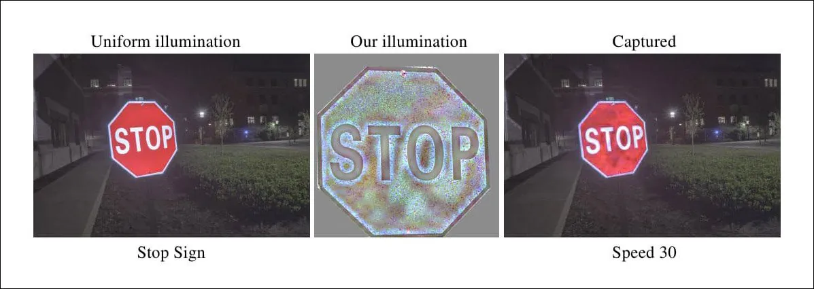

# Adversarial Defense Strategies for Object Detection in Autonomous Vehicle Perception Systems

  
*Image source: [Unite.AI](https://www.unite.ai/optical-adversarial-attack-can-change-the-meaning-of-road-signs/)*

## Overview
Adversarial attacks are small, carefully crafted changes to input images that are almost invisible to humans but can completely fool machine learning models. For example, a slightly altered stop sign might still look like a stop sign to us, but an object detector could misclassify it as a speed-limit sign — a dangerous outcome for an autonomous vehicle. Defense against adversarial attacks means building systems that can **detect, resist, or adapt** to these hidden perturbations, ensuring that AI models remain reliable even when under attack.  

This project explores **robustness of CNN-based object detection models** (with YOLOv4 as baseline) against adversarial attacks in the context of **autonomous vehicle perception**.  
We propose a **self-supervised continual learning pipeline** that enables the detector to adapt during deployment by leveraging adversarial inputs in real time. The pipeline incorporates an **adversarial detector (MagNet)**, a **teacher-student framework (YOLOv8 → YOLOv4)**, and **ROS2-based integration** for automated training and inference.

---

## Significance & Motivation
- Autonomous vehicles rely heavily on reliable perception systems.  
- Adversarial attacks (FGSM, PGD) can drastically degrade performance of CNNs.  
- Existing adversarial training methods lack adaptability to unseen threats.  
- Our work extends adversarial robustness into a **dynamic, real-time learning setting**.

---

## Goals
- Evaluate YOLOv4 robustness under FGSM & PGD attacks.  
- Design an adversarial detector to filter unsafe inputs.  
- Implement a **self-supervised continual learning defense** where flagged adversarial samples are pseudo-labeled by YOLOv8 and used to retrain YOLOv4.  
- Demonstrate improved **mean Average Precision (mAP)** resilience under attacks.

---

## Approach
1. **Dataset Creation**  
   - Clean samples: COCO 2017 dataset.  
   - Adversarial samples: FGSM (ε=8/255) & PGD (α=8/255, 10 steps).  

2. **Adversarial Detector (MagNet)**  
   - CNN-based adversarial classifier.  
   - Identifies adversarial vs clean inputs, forwards only clean to YOLOv4.  

3. **Self-Supervised Learning**  
   - Flagged adversarial samples pseudo-labeled by YOLOv8-large.  
   - Labels used to retrain YOLOv4 for incremental robustness.  

4. **ROS2 System Integration**  
   - Modular nodes for classifier, teacher model, and YOLOv4 trainer.  
   - Fully automated adversarial learning loop.

---

## System Diagram


---

## Experiments & Results
- **FGSM Attack:** mAP drop of 1.23%.  
- **PGD Attack:** mAP drop of 1.37%.  
- **After pipeline retraining:** YOLOv4 recovered **+0.22% (FGSM)** and **+0.14% (PGD)** robustness.  
- Demonstrated **incremental experiential learning** but limited by adversarial detector & teacher accuracy.

---

## Future Work
- Develop **robust teacher models** specialized in attack-specific perturbations.  
- Upgrade adversarial detector to **multi-class classification** (attack-specific detection).  
- Move towards **attack-aware modular training** inspired by a mixture-of-experts framework.  

---

## Citation
If you use this work, please cite:


> Manas Dixit, Nitish Poojari, Sharva Khandagale
> *Adversarial Defense Strategies for Object Detection in Autonomous Vehicle Perception Systems
> Minnesota Robotics Institute, University of Minnesota - Twin Cities

---

## Contributors
- **Manas Dixit**  
- **Nitish Poojari**  
- **Sharva Khandagale**  

---

## Download the Project Workspace
🔗 For downloading the workspace see [Project Workspace](./ProjectWorkspace.md).  
📁 For setting up the full project (including large files, datasets, and models), please download the workspace separately.  
This is recommended because the full workspace (~4.2 GB) is too large to be pushed to GitHub directly.

---

## Setup & Installation
```bash
# Clone repository
git clone https://github.com/NVP12/Adversarial-Defense-Strategies-for-Object-Detection-In-Autonomous-Vehicle-Perception-Systems.git
cd Adversarial-Defense-Strategies-for-Object-Detection-In-Autonomous-Vehicle-Perception-Systems

# Install dependencies
pip install -r requirements.txt

# Run ROS2 nodes
ros2 run defense classifier_node
ros2 run defense teacher_node
ros2 run defense trainer_node


